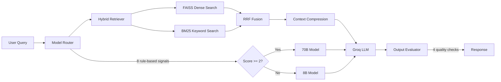

# ClearPath Customer Support Chatbot

A RAG-powered chatbot that answers user questions by retrieving relevant content from 30 ClearPath PDF documents and generating responses via Groq's Llama models.

## Architecture



## Setup and Run Locally

### Prerequisites

- Python 3.8 or higher
- Git
- A Groq API key from [console.groq.com](https://console.groq.com)

### Step 1: Clone the Repository

```bash
git clone https://github.com/Yash020405/lemnisca_takeHomeAssignment.git
cd lemnisca_takeHomeAssignment
```

### Step 2: Set Up Python Environment

```bash
# Create virtual environment
python3 -m venv backend/venv

# Activate virtual environment
source backend/venv/bin/activate  # On Windows: backend\venv\Scripts\activate

# Install dependencies
pip install -r backend/requirements.txt
```

### Step 3: Configure Environment Variables

```bash
# Copy example environment file
cp backend/.env.example backend/.env

# Edit backend/.env and add your Groq API key
# GROQ_API_KEY=your_actual_api_key_here
```

### Step 4: Run the Server

```bash
# Make sure virtual environment is activated
uvicorn backend.app.main:app --host 0.0.0.0 --port 8000
```

**First Startup:** Downloads the embedding model (~80MB) and builds the FAISS index (~30 seconds). The index is cached to `backend/index_cache/` for faster subsequent starts.

### Step 5: Open the Application

Open your browser and navigate to:
```
http://localhost:8000
```

You should see the ClearPath chatbot interface. Try a test query like "What is ClearPath?" to verify everything works.

### Alternative: Run with Docker

```bash
# Build image
docker build -t clearpath-chatbot .

# Run container
docker run -p 8000:8000 -e GROQ_API_KEY=your_key clearpath-chatbot
```

## Testing

### Run Automated Tests

The project includes 31 automated test cases covering routing logic, retrieval accuracy, quality evaluation, and edge cases.

```bash
# 1. Start the server in one terminal
source backend/venv/bin/activate
uvicorn backend.app.main:app --host 0.0.0.0 --port 8000

# 2. In another terminal, run tests
source backend/venv/bin/activate
python -m pytest backend/tests/test_eval_harness.py -v

# Run specific test
pytest backend/tests/test_eval_harness.py::test_router_classification -v

# Show detailed output
pytest backend/tests/test_eval_harness.py -v -s
```

### Manual Testing Scenarios

Test the routing and retrieval manually:

1. **Simple Query (8B Model):**
   - "What is ClearPath?"
   - Should route to 8B model, return basic info

2. **Complex Query (70B Model):**
   - "Compare the pricing plans and recommend one for a small team"
   - Should route to 70B model, provide detailed comparison

3. **Conversation Memory:**
   - First: "What is the enterprise plan?"
   - Then: "How much does it cost?"
   - Should remember context from first question

4. **Edge Case:**
   - "Can ClearPath predict lottery numbers?"
   - Should refuse gracefully with no hallucination

Check the debug panel on the right side to see:
- Which model was used (8B or 70B)
- Router classification score and rationale
- Token usage (input/output)
- Evaluator flags (quality checks)
- Retrieved source documents

## Demo Video

**[Watch Demo Video](https://www.loom.com/share/2889cf67e8534bc1b737ba3d15de87bd)**

See the chatbot in action: routing logic, hybrid retrieval, streaming responses, and evaluation in a 5-minute walkthrough.

## Models

| Model | Groq String | When Used |
|-------|-------------|-----------|
| Llama 3.1 8B | `llama-3.1-8b-instant` | Simple queries: greetings, factual lookups |
| Llama 3.3 70B | `llama-3.3-70b-versatile` | Complex queries: comparisons, troubleshooting, complaints |

## Environment

```bash
GROQ_API_KEY=your_key  # Required
```

## Project Structure

```
lemnisca_takeHomeAssignment/
├── backend/
│   ├── app/
│   │   ├── main.py                 # FastAPI entry point
│   │   ├── config.py               # Settings
│   │   ├── api/routes.py           # /query, /query/stream, /health
│   │   ├── rag/
│   │   │   ├── pdf_loader.py       # PDF extraction
│   │   │   ├── chunker.py          # Character-based chunking
│   │   │   ├── embedder.py         # Sentence-transformers
│   │   │   ├── retriever.py        # FAISS + BM25 hybrid
│   │   │   ├── hybrid_retriever.py # BM25 index + RRF
│   │   │   └── compressor.py       # Selective context compression
│   │   ├── router/classifier.py    # Rule-based classifier (8 signals)
│   │   ├── evaluator/output_checker.py  # 4-flag evaluator
│   │   ├── llm/groq_client.py      # Groq API (regular + streaming)
│   │   └── memory/
│   │       ├── conversation.py     # 5-turn memory window
│   │       └── cache.py            # Normalized semantic cache
│   └── tests/test_eval_harness.py  # 31 test cases
├── frontend/
│   ├── index.html
│   ├── style.css
│   └── app.js
├── docs/                           # 30 ClearPath PDFs
├── written_answers.md
└── README.md
```

## Bonus Challenges

| Challenge | Status | Implementation |
|-----------|--------|----------------|
| Conversation Memory | Done | In-memory 5-turn window, persists via `conversation_id` |
| Streaming | Done | Token-by-token SSE via `POST /query/stream` |
| Eval Harness | Done | 31 pytest cases: routing, retrieval, quality, edge cases |

## Known Limitations

1. **Conversation memory is in-memory** - resets on server restart
2. **Table extraction is lossy** - pypdf flattens table structures, affecting pricing/comparison answers
3. **Single embedding model** - all-MiniLM-L6-v2 works but a domain-tuned model would improve retrieval